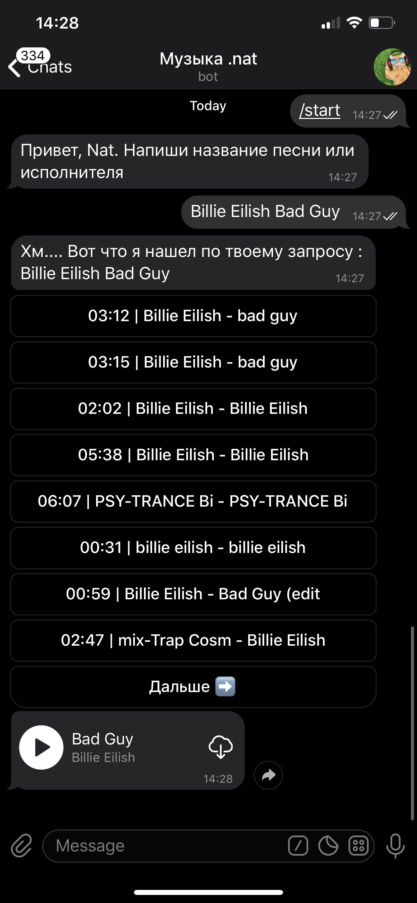
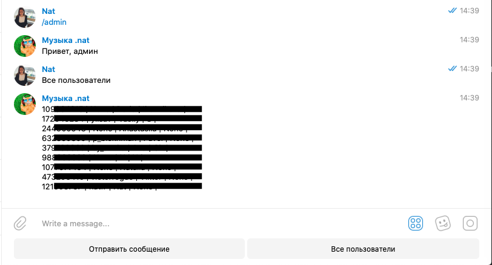
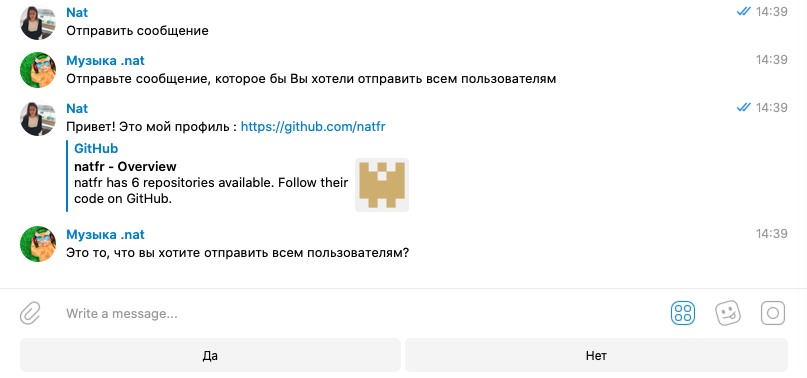

#Telegrambot "Music offline"
__________
#### Telegrambot parsing audio from the music portal in response to the user's request.
   The project was created for study purposes.
__________
#### Installation
   1. Install all used packages from requirements.txt (python 3.7).
   2. Create "settings.py" file with Bot_key, Proxy and etc. (please find the info below).
   3. Launch "telegram_bot_main.py"
__________
#### Server  = https://www.pythonanywhere.com/
   "base_url" (bot) is turned off on Server, because Server solves the problem of VPN itself.
__________
#### Content
   The project includes the next files:
   1. telegram_bot_main.py
   2. music_parsing.py (to parse songs from the music portal)
   3. buttons.py (all used keyboards and buttons)
   4. settings.py (please find the info below)
   5. requirements.txt (all used packages)
   6. admin.py(functions related to admin role)
   7. analytics.py (functions collecting data about users)
   8. readme.txt (you are here :))
   9. chat_id.csv  (file with IDs of users)
   10. bot.log
   11. .gitignore
__________
#### File "settings.py"

    PROXY={'proxy_url': 'socks5h://***********'}
    HEADERS={'user-agent': '**********'}
    Bot_key='*******:******'
    Base_url='*************'
    Bot_admin=********  (integer)
__________
#### Additional references
   1. https://bitbucket.org/vkasatkin/tele_bot/src/master/echo/main.py
   2. https://bitbucket.org/vkasatkin/tele_bot/src/master/echo/main.py
   3. https://github.com/python-telegram-bot/python-telegram-bot/blob/master/examples/inlinekeyboard.py
   4. https://github.com/python-telegram-bot/python-telegram-bot/wiki/Code-snippets#post-an-image-file-from-disk    
   5. https://www.youtube.com/watch?v=JC2QSNrOUs8
   6. https://www.youtube.com/watch?v=oNbLYL8vZnE
   7. https://www.youtube.com/watch?v=FhL0uC1kGCA
   8. https://www.youtube.com/watch?v=zKuBDil5dlw&pbjreload=10
__________
#### Contact details
   natfr (telegram)
   __________ 
#### Instruction
   If you want to listen to music offline:
   1. /start
   2. Write your request (for example: Billie Eilish Bad Guy)
   3. Choose one and click
   4. Click on "cloud" symbol to download
    
    
   If you are Admin and want to see all users:
   1. /admin
   2. Click 'Все пользователи' (all users)
    
   
   If you are Admin and want to send a message to users:
   1. /admin
   2. Click 'Отправить сообщение' (write the message)
   3. Write your message and send it to the bot
   4. If your message is ok, click 'Да' (yes) to send it to admin. You can send it to all users: go to Bot.admin.admin_approval (lines 94-104).
    